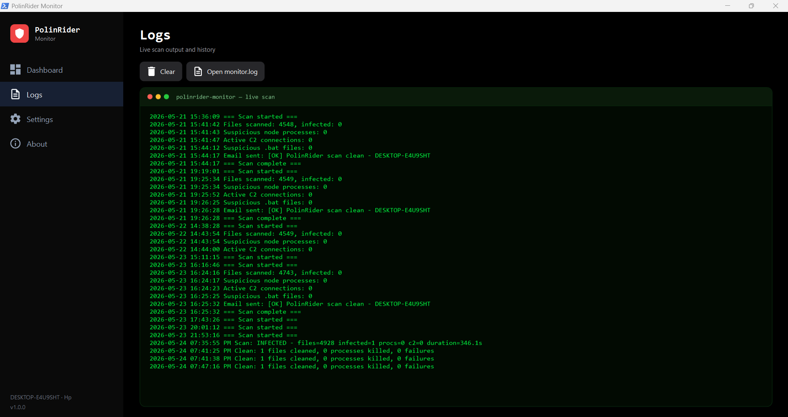

# PolinRider Monitor

A free, open-source desktop tool for Windows that detects and removes the **PolinRider / BeaverTail** JavaScript supply-chain malware (DPRK Lazarus) on your machine and in your git working trees.


If you've ever cloned a JavaScript or TypeScript project from GitHub, you can be infected without knowing it. PolinRider hides obfuscated JavaScript at the end of common config files like `postcss.config.mjs`, `tailwind.config.js`, `next.config.mjs`, `vite.config.js`, Express route files, and Flutter `canvaskit.js` bundles. When you run `npm install` or `npm run dev`, the payload executes — and starts force-pushing the same malware to every GitHub repo your credentials can reach.

PolinRider Monitor scans for the malware's unique fingerprints, identifies and kills running infections, and secures your machine in one click.

## Features

- 🔍 **Recursive scan** of every `.js`, `.mjs`, `.cjs`, `.jsx`, `.ts`, `.tsx` file under any folders you choose — `node_modules` is automatically excluded
- 🎯 **Four detection layers**:
  - PolinRider obfuscation marker strings inside source files
  - Malicious `node.exe -e` processes currently running the payload
  - Active TCP connections to known PolinRider C2 endpoints (`166.88.54.158` and the blockchain dead-drop RPCs)
  - `temp_auto_push.bat`-style git-history-rewriting droppers
- 🧹 **One-click "Secure Machine"** — strips the injected `createRequire` shim and trailing payload from each infected file, kills malicious processes, and updates the dashboard immediately
- 📊 **Live progress** — circular spinner, file count, elapsed time, current folder, and the ability to **stop the scan** at any time
- 📝 **Matrix-styled live log** — see every file as it's scanned in real time
- ⚙️ **Settings page** with a folder picker — add or remove scan paths visually, no JSON editing required
- 💾 **50-entry scan history** with color-coded result badges so you can track recurrence
- 🔒 **Everything runs locally** — no telemetry, no network calls except to your own machine and the directories you tell it to scan

## What it does NOT do

- It does not push to GitHub for you. If a cleaned file is in a git repo, you still need to commit and push to fix the remote.
- It does not modify your firewall (we recommend doing that manually — see [Hardening](#hardening-block-known-c2-ips) below).
- It does not send any data to anyone.

## Screenshots

### Dashboard
At-a-glance scan status, four stat tiles (files scanned, infections found, malicious processes, C2 connections), big **Scan Now** / **Secure Machine** buttons, and a styled card list of past scans.


### Live scan logs
Matrix-themed terminal that shows the folder and file currently being scanned, in real time, plus a running count of files scanned. Click **Stop Scan** to cancel cooperatively.



## Install

1. Download or clone the repo to a folder, e.g. `C:\Tools\polinrider-monitor`:
   ```bash
   git clone https://github.com/Saif-Arshad/polinrider-monitor.git
   ```
2. Open PowerShell, navigate to the folder, and run the installer (no admin required):
   ```powershell
   cd C:\Tools\polinrider-monitor
   .\install.ps1
   ```
3. A **PolinRider Monitor** shortcut appears on your Desktop. Double-click to launch.

If you'd rather skip the installer, just double-click `PolinRiderMonitor.vbs` in the folder — that launches the app without a PowerShell console window.

## Usage

The app has four pages, accessible from the left sidebar:

### Dashboard
1. Click **Scan Now**. The app auto-navigates to the Logs page so you can watch live progress.
2. Scan takes ~5–10 minutes depending on disk size (typical ~5000 JS/TS files).
3. When the scan completes, switch back to Dashboard:
   - Subtitle updates to `Last scan: CLEAN ...` or `Last scan: INFECTED ...`
   - Four stat tiles fill in
   - A new color-coded card appears in **Scan history** (green CLEAN / red INFECTED / gray STOPPED)
4. If infections are found, click **Secure Machine**. The app strips the payload from every infected file and kills any malicious processes. The dashboard refreshes immediately.

### Logs
- Matrix-themed terminal that shows live scan output during a scan
- After a scan ends, shows the last 100 lines of `monitor.log`
- **Clear** wipes the on-screen log; **Open monitor.log** opens the persistent log in Notepad
- During a scan, a **Stop Scan** button appears next to a spinning loader so you can cancel

### Settings
- Add or remove scan paths via a folder picker (no JSON editing required)
- Configure max file size, auto-scan on launch
- Click **Save Settings** to persist changes to `config.json`

### About
- Project info, version, and links to the OSM technical writeup and IoC dossier

## Securing a git repo after cleanup

If "Secure Machine" cleaned a file that's tracked in a git repo, you still need to push the fix so the remote stops infecting other developers:

```bash
cd <your-repo>
git add <file>
git commit -m "Remove PolinRider malicious payload"
git push
```

Repeat for each repo that had infected files. Until you do this, anyone (including yourself) who clones or pulls that repo will pull the payload back down.

## Configuration

The app stores its settings in `config.json` next to `app.ps1`. The **Settings** page in the UI is the easiest way to edit, but you can also edit the file directly:

```json
{
    "ScanPaths": [
        "C:\\Development",
        "C:\\Users\\YOU\\OneDrive",
        "C:\\Users\\YOU\\Desktop",
        "C:\\Users\\YOU\\Documents",
        "C:\\Users\\YOU\\Downloads",
        "C:\\Users\\YOU\\source",
        "C:\\Users\\YOU\\projects"
    ],
    "MaxFileSize": 10000000,
    "AutoScanOnLaunch": false
}
```

- `ScanPaths` — directories that get scanned recursively (`node_modules` is always excluded)
- `MaxFileSize` — skip files larger than this (bytes). Default 10 MB.
- `AutoScanOnLaunch` — if `true`, automatically starts a scan when the app opens

## Hardening: block known C2 IPs

If a scan confirms an infection, run these as **administrator** to block the attacker's C2 server at the Windows firewall — this prevents the malware from exfiltrating data to its dropper VPS even if it gets executed again before you clean it:

```powershell
New-NetFirewallRule -DisplayName "Block PolinRider C2 (166.88.54.158) outbound" `
  -Direction Outbound -Action Block -RemoteAddress 166.88.54.158 -Protocol Any -Enabled True
New-NetFirewallRule -DisplayName "Block PolinRider C2 (166.88.54.158) inbound" `
  -Direction Inbound -Action Block -RemoteAddress 166.88.54.158 -Protocol Any -Enabled True
```

## How it works

The four marker strings PolinRider's obfuscation routine always emits are unique enough that finding two or more of them in the same file is high-confidence evidence of infection. The marker strings are built from character codes at runtime so this script doesn't get flagged by Windows Defender for containing the same signatures it's meant to detect.

For cleanup, the payload follows a predictable layout:
1. (Sometimes) two injected import lines near the top: `import { createRequire } from 'module';` + `const require = createRequire(import.meta.url);`
2. The legitimate code
3. A long whitespace pad
4. The injected payload, starting with `global['!']=...`

Stripping (1) and everything from (4) onward restores the original file. The Secure Machine button runs this against every infected file in the last scan and then kills any malicious processes detected.

## Background reading

- **PolinRider technical analysis** — https://opensourcemalware.com/blog/polinrider-attack
- **OSM PolinRider dossier (IoCs, YARA rules)** — https://github.com/OpenSourceMalware/PolinRider
- **The Invisible Patch: PolinRider history-rewriting trick** — https://securityonline.info/polinrider-dprk-malware-github-history-falsification/

## Tech stack

- **PowerShell + WPF** — single-file desktop app, no external dependencies
- **Material Design Icons** (Apache 2.0) — embedded as vector path geometries, no font required
- **Background runspaces** — scans run on a worker thread so the UI stays responsive
- **DispatcherTimer** — drains live scan output into the UI at 300ms intervals
- **DPAPI** (no longer used; previous versions persisted SMTP credentials this way)

## Project layout

```
polinrider-monitor/
├── app.ps1                  # Main WPF dashboard
├── PolinRiderMonitor.vbs    # Launcher (hides console)
├── install.ps1              # Creates Desktop shortcut + default config.json
├── uninstall.ps1            # Removes shortcut + any scheduled tasks
├── README.md
├── LICENSE                  # MIT
├── .gitignore               # Excludes runtime state files
└── docs/
    └── screenshots/
```

Runtime files (not in git):
- `config.json` — your scan paths and options
- `history.json` — last 50 scan results
- `monitor.log` — append-only scan log

## Contributing

Issues and PRs welcome. Some areas that could use help:
- macOS and Linux ports
- Detection signatures for newer PolinRider variants
- Auto-deploying Windows Firewall rules from inside the app
- A scheduled-task installer for users who want auto-scan at logon

## License

MIT — see [LICENSE](LICENSE).

## Disclaimer

This is a community tool, provided as-is, with no warranty. Always verify cleanups against the original (uninfected) source files before pushing. If you find a variant this tool misses, please open an issue.
