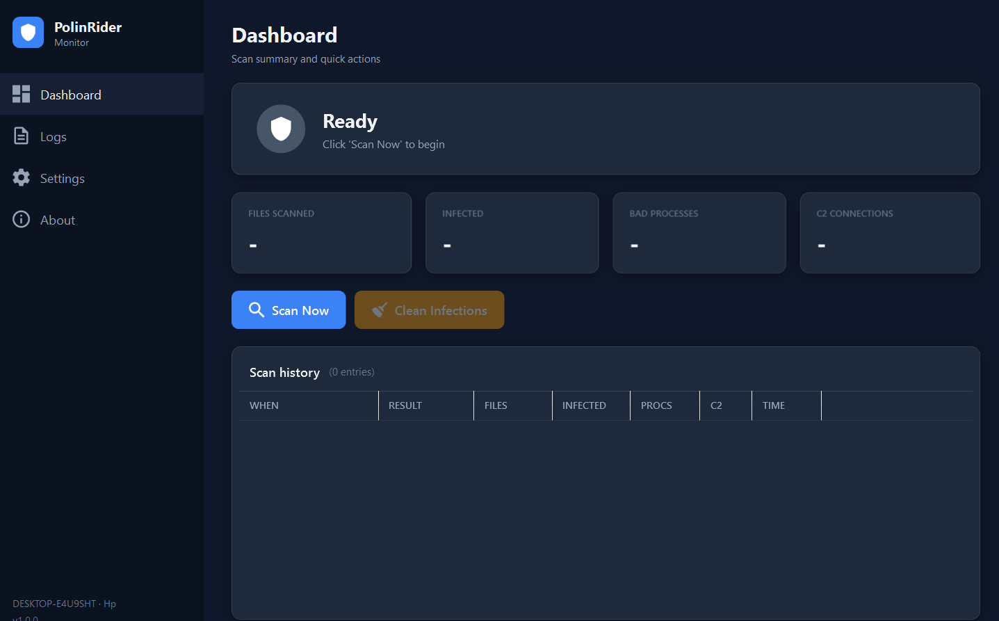

# PolinRider Monitor

A free, open-source desktop tool for Windows that detects and removes the **PolinRider / BeaverTail** JavaScript supply-chain malware (DPRK Lazarus) on your machine and in your git working trees.



If you've ever cloned a JavaScript or TypeScript project from GitHub, you can be infected without knowing it. PolinRider hides obfuscated JavaScript at the end of common config files like `postcss.config.mjs`, `tailwind.config.js`, `next.config.mjs`, `vite.config.js`, Express route files, and Flutter `canvaskit.js` bundles. When you run `npm install` or `npm run dev`, the payload executes — and starts force-pushing the same malware to every GitHub repo your credentials can reach.

PolinRider Monitor scans for the malware's unique fingerprints, identifies and kills running infections, blocks known C2 IPs, and cleans the infected files for you.

## What it does

- **Scans** every `.js`, `.mjs`, `.cjs`, `.jsx`, `.ts`, `.tsx` file under common project roots (`C:\Development`, OneDrive, Desktop, Documents, Downloads, etc.) for the unique PolinRider obfuscation markers
- **Detects** malicious `node.exe -e` processes currently running the payload
- **Detects** active TCP connections to known PolinRider C2 endpoints (including the recently-discovered IP `166.88.54.158` and the blockchain dead-drop RPCs documented by OpenSourceMalware)
- **Detects** `temp_auto_push.bat`-style git-history-rewriting droppers
- **Cleans** infected files in one click (strips the injected `createRequire` shim and the trailing obfuscated payload)
- **Kills** malicious processes
- **Persists** a 50-entry scan history so you can track recurrence

## What it does NOT do

- It does not push to GitHub for you. If a cleaned file is in a git repo, you still need to commit and push to fix the remote.
- It does not modify your firewall (we recommend doing that manually — see Hardening below).
- It does not send data to anyone. Everything runs locally.

## Screenshots

*(Add your screenshots to `docs/screenshots/` and link them here.)*

## Install

1. Download or clone the repo to a folder, e.g. `C:\Tools\polinrider-monitor`
2. Right-click PowerShell → "Run as administrator" (only needed for the install step) and run:
   ```powershell
   cd C:\Tools\polinrider-monitor
   .\install.ps1
   ```
3. A "PolinRider Monitor" shortcut appears on your Desktop. Double-click to launch.

If you skip the installer you can also just double-click `PolinRiderMonitor.vbs` directly — that launches the app without a PowerShell console window.

## Usage

1. Launch the app from the Desktop shortcut.
2. Click **Scan Now**. Takes ~5–10 minutes depending on disk size.
3. The status banner turns **green** (clean) or **red** (infections detected).
4. If red, click **Clean Infections**. The app strips the payload from each infected file and kills any malicious processes.
5. For any cleaned file that's tracked in a git repo, commit + push from a terminal so the remote also gets fixed:
   ```bash
   cd <repo>
   git add <file>
   git commit -m "Remove PolinRider malicious payload"
   git push
   ```

## Configuration

Open `config.json` next to `app.ps1` to customise:

```json
{
    "ScanPaths": [
        "C:\\Development",
        "C:\\Users\\YOU\\OneDrive",
        "C:\\Users\\YOU\\Desktop",
        "C:\\Users\\YOU\\Documents",
        "C:\\Users\\YOU\\Downloads",
        "C:\\Users\\YOU\\source",
        "C:\\Users\\YOU\\projects"
    ],
    "MaxFileSize": 10000000,
    "AutoScanOnLaunch": false
}
```

- `ScanPaths` — directories that get scanned recursively (excluding `node_modules`)
- `MaxFileSize` — skip files larger than this (bytes). Default 10 MB.
- `AutoScanOnLaunch` — if `true`, kicks off a scan automatically when the app opens

You can also click ⚙ Settings inside the app to open this file in Notepad.

## Hardening: block known C2 IPs

If you confirm an infection, run these as **administrator** to block the attacker's C2 server at the Windows firewall:

```powershell
New-NetFirewallRule -DisplayName "Block PolinRider C2 (166.88.54.158) outbound" `
  -Direction Outbound -Action Block -RemoteAddress 166.88.54.158 -Protocol Any -Enabled True
New-NetFirewallRule -DisplayName "Block PolinRider C2 (166.88.54.158) inbound" `
  -Direction Inbound -Action Block -RemoteAddress 166.88.54.158 -Protocol Any -Enabled True
```

## Background reading

- **PolinRider technical analysis** — https://opensourcemalware.com/blog/polinrider-attack
- **OSM PolinRider dossier (IoCs, YARA rules)** — https://github.com/OpenSourceMalware/PolinRider
- **The Invisible Patch: PolinRider history-rewriting trick** — https://securityonline.info/polinrider-dprk-malware-github-history-falsification/

## How it works

The four marker strings PolinRider's obfuscation routine always emits are unique enough that finding two or more of them in the same file is high-confidence evidence of infection. The marker strings are built from character codes at runtime so this script doesn't get flagged by Windows Defender for containing the same signatures it's meant to detect.

For cleanup, the payload follows a predictable layout:
1. (Sometimes) two injected import lines near the top: `import { createRequire } from 'module';` + `const require = createRequire(import.meta.url);`
2. The legitimate code
3. A long whitespace pad
4. The injected payload, starting with `global['!']=...`

Stripping (1) and everything from (4) onward restores the original file.

## Contributing

Issues and PRs welcome. Some areas that could use help:
- macOS and Linux ports
- Detection signatures for newer PolinRider variants
- Network firewall rule auto-deployment
- A scheduled-task installer for users who want auto-scan at logon

## License

MIT — see [LICENSE](LICENSE).

## Disclaimer

This is a community tool, provided as-is, with no warranty. Always verify cleanups against the original (uninfected) source files before pushing. If you find a variant this tool misses, please open an issue.
